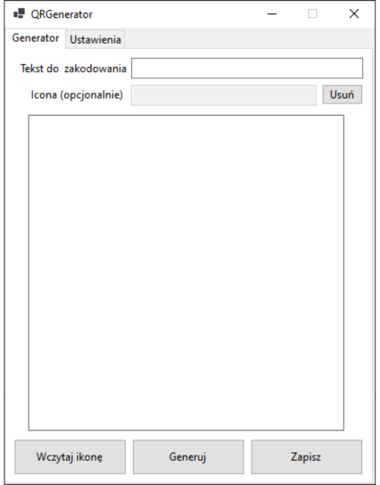
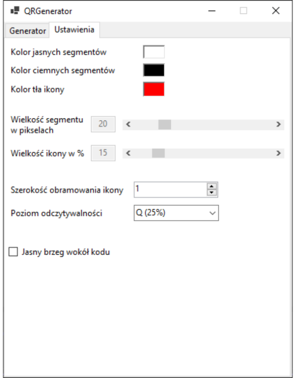

# QRCodeGenerator

## 📋 Description
QRCodeGenerator is a small and simple application for generating QR codes, built using the QRCoder library in C#. The application features a Windows Forms (WinForms) interface that allows users to input text, generate QR codes, and save them as PNG files.

## ✨ Features

- **Text Input**: Users can input any text they wish to convert into a QR code.
- **QR Code Generation**: Generate high-quality QR codes quickly and easily.
- **Save as PNG**: Save the generated QR codes as PNG files for future use.
- **Customizable Settings**: Adjust QR code generation settings to suit your needs, such as error correction levels and QR code size.
- **Icon Integration**: Add a custom icon or logo to the center of the QR code to personalize it.

## 🛠️ Technology Stack

- **.NET 8.0**
- **.NET Core**
- **Windows Forms (WinForms)**: Classic desktop UI for Windows.

## 📂 Application Tabs

The application is built with two main tabs.

### 1. Generator 📊



### 2. Settings 🛠️



## 🚀 Installation

1. **Clone the Repository**

   Clone the repository to your local machine by running the following command:
   ```bash
   git clone https://github.com/DamianSubzda/QRCodeGenerator.git
   ```

3. **Install Necessary Packages**

   Navigate to the project directory and restore the required packages by running:
   ```bash
   dotnet restore
   ```
   
4. **Run the Application**

   Launch the WinForms project in Visual Studio or use the following command:
    ```bash
    dotnet run
    ```

## License

This project is licensed under the MIT License. See the LICENSE file for more details.
